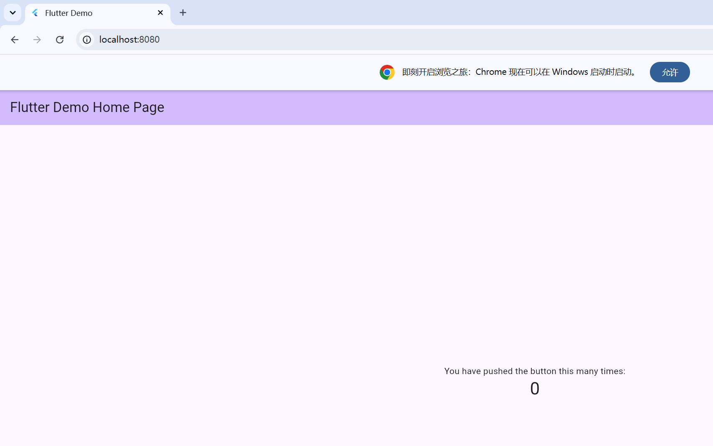

# hello_world

《移动应用软件开发实训》课程1 课堂案例 —— 第一个 Flutter 应用。

## 项目简介

本项目是课程第一个 Flutter 示例应用，实现一个简单的计数器：点击右下角"+"按钮，计数器自增。项目同时验证 Flutter 在多端（Web、Android）的运行能力。

## 环境信息

- Flutter 3.47.2（Channel stable）
- Dart 3.13.2
- 操作系统：Windows 11
- 运行目标：Chrome（Web）、Android 模拟器（sdk gphone64 x86 64）

## 运行方式

### 1. 安装依赖

```bash
flutter pub get
```

### 2. Web 端运行

```bash
flutter run -d chrome
```

浏览器自动打开，看到计数器示例即成功。终端交互：按 `r` 热重载、按 `R` 热重启、按 `q` 退出。

### 3. Android 模拟器运行

先在 Android Studio 的 Device Manager 创建并启动一台模拟器，然后：

```bash
flutter devices               # 查看可用目标
flutter run -d emulator-5554  # 在指定模拟器运行
```

## 多端运行截图

### Web 端运行



### Android 模拟器运行


## 项目结构

```
hello_world/
├── lib/
│   └── main.dart        # 应用入口，含逐行中文注释
├── android/             # Android 平台工程
├── ios/                 # iOS 平台工程
├── web/                 # Web 平台工程
├── windows/             # Windows 桌面工程
├── test/                # 测试
├── docs/                # 运行截图与诊断输出
│   ├── web_run.png
│   ├── emulator_run.png
│   └── flutter_doctor_output.txt
└── pubspec.yaml         # 依赖与资源声明
```

## flutter doctor 诊断

详见 [docs/flutter_doctor_output.txt](docs/flutter_doctor_output.txt)，全部项目为 ✓（全绿）。
